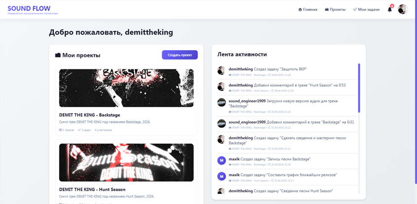
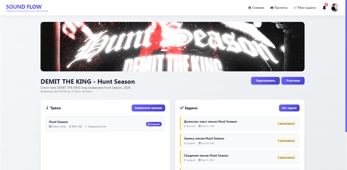
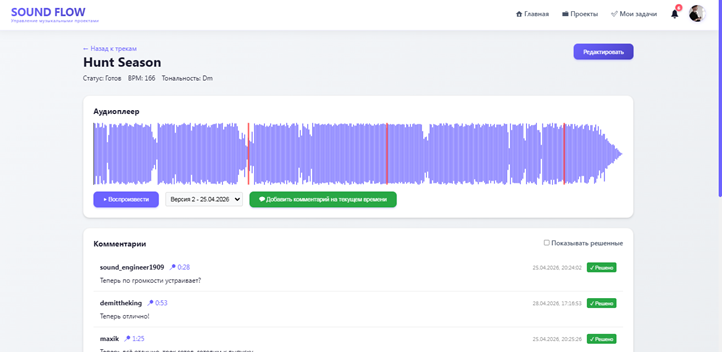
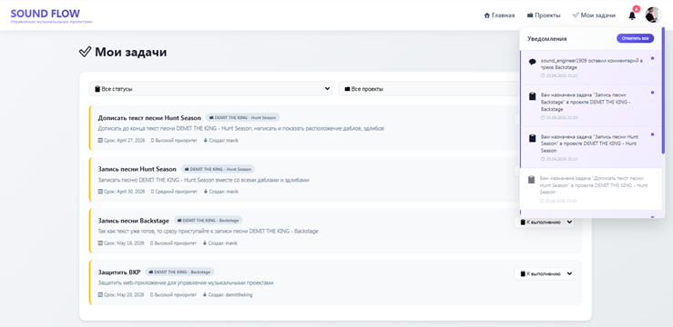

# SOUND FLOW - специализированное Web-приложение для управления музыкальными проектами

## Контакты

GitHub: github.com/demittheking
Email: dkarasev42@gmail.com

## О проекте

**SOUND FLOW** — это специализированное веб-приложение для совместной работы музыкантов, продюсеров и менеджеров над музыкальными проектами. Платформа позволяет создавать проекты, загружать аудиофайлы, оставлять комментарии с привязкой к таймкоду, управлять задачами и участниками. Это решение, в отличие от универсальных систем (Trello, Notion), ориентировано на работу с аудио и предлагает встроенный плеер с визуализацией и комментариями по таймкоду.

### Актуальность

В процессе создания каждого музыкального продукта происходит множество различных процессов, но в настоящее время в музыкальной индустрии до сих пор нет универсальной и удобной платформы для координации задач на цикле жизни музыкального проекта.
Людям приходится использовать мессенджеры, облачные хранилища, электронные таблицы и другие различные сервисы, чтобы выполнить те или иные действия. Всё это приводит к повышению длительности работы над проектами, различным издержкам, убыткам и ухудшает весь творческий процесс.

### Ключевая особенность

**Аудиоплеер с визуализацией и маркерами комментариев** — уникальная функция, позволяющая оставлять замечания к конкретным моментам аудиодорожки, что значительно упрощает процесс совместной работы над музыкой.

---

## 📸 Скриншоты

### Главная страница

### Страница проекта

### Аудиоплеер с маркерами комментариев

### Страница задач с открытым окном уведомлений

---

## Функциональные возможности

### Для музыкантов и продюсеров

- **📁 Управление проектами** — создание, редактирование, статусы (черновик/активен/завершён), обложки
- **🎵 Треки и аудио** — загрузка нескольких версий, BPM, тональность, версионирование
- **💬 Комментарии с таймкодами** — привязка замечаний к точному времени аудио, цветные маркеры
- **👥 Командная работа** — приглашение участников, роли (владелец/редактор/наблюдатель)

### Для управления задачами

- **✅ Задачи** — создание, назначение исполнителей, приоритеты (низкий/средний/высокий)
- **📅 Сроки выполнения** — контроль дедлайнов, подсветка просроченных задач
- **📊 Фильтрация** — по проектам и статусам

### Коммуникация и контроль

- **🔔 Уведомления** — оповещения о комментариях, назначении и выполнении задач
- **📋 Лента активности** — хронология всех событий в проектах
- **👤 Профили пользователей** — аватары, личная информация

---

## Технологический стек

**Бэкенд**
- Python 3.8
- Django 4.2
- SQLite3
- Django REST Framework

**Фронтенд**
- HTML5 / CSS3
- JavaScript (ES6)
- Wavesurfer.js

**Тестирование**
- Django Test Framework
- Coverage

**Дополнительно**
- Pillow

---

## Быстрый старт

### Системные требования

- Python 3.8 или выше
- Git (опционально)
- 500 MB свободного дискового пространства

### Установка и запуск

#### 1. Клонирование репозитория

git clone https://github.com/demittheking/soundflow.git
cd soundflow

2. Создание виртуального окружения
Windows:
   
python -m venv venv
venv\Scripts\activate

Mac/Linux:

python3 -m venv venv
source venv/bin/activate

3. Установка зависимостей

pip install -r requirements.txt

4. Настройка базы данных

python manage.py migrate

5. Создание администратора

python manage.py createsuperuser

6. Запуск сервера разработки

python manage.py runserver

7. Открытие в браузере

http://127.0.0.1:8000/

8. Загрузка собственных файлов (аудио и обложек песен)

# Тестирование
Запуск всех тестов

python manage.py test

Запуск тестов конкретного приложения

python manage.py test projects
python manage.py test tracks
python manage.py test tasks_app
python manage.py test core
 
Измерение покрытия кода (coverage)

# Установка coverage
pip install coverage

# Запуск тестов с измерением покрытия
coverage run manage.py test

# Отчёт в консоли
coverage report

# HTML-отчёт (открыть htmlcov/index.html)
coverage html

Результаты тестирования

Ran 14 tests in 20.56s
OK

Coverage report: 75%

## Роли пользователей

- **Владелец** — полный доступ: редактирование проекта, управление участниками, удаление
- **Редактор** — создание и редактирование треков, задач, комментариев
- **Наблюдатель** — только просмотр

## Безопасность

- Аутентификация через Django Auth
- Декоратор `@login_required` для защиты маршрутов
- Проверка прав доступа к проектам
- CSRF защита на всех формах
- XSS защита через экранирование в шаблонах

## Структура проекта

music_management/
├── core/ # Аутентификация и главная страница
├── projects/ # Управление проектами
├── tracks/ # Треки и аудиоплеер
├── tasks_app/ # Задачи
├── notifications/ # Уведомления
├── templates/ # HTML шаблоны
├── static/ # CSS/JS файлы
└── media/ # Загруженные файлы

## Автор

Студент: Карасёв Дмитрий Александрович
Группа: ИВТ-223
Учебное заведение: ОмГТУ
Факультет: Факультет информационных технологий и компьютерных систем
Кафедра: Информатика и вычислительная техника

Проект защищен на оценку "Отлично" с присвоением статуса "Практическая ценность"

Научный руководитель: старший преподаватель, Карабцов Роман Дмитриевич